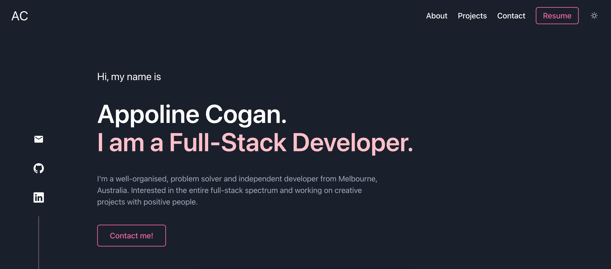

# React Portfolio

## Table of content

- [Description of Project](#description-of-project)
- [Link to deployed application](#link-to-deployed-application)
- [Screenshot of deployed application](#screenshot-of-deployed-application)

## Description of Project

This project is a single-page application portfolio using React. It features all the most important projects I have been working on as part of my full stack bootcamp.

### Link to deployed application

[Link to deployed application](https://acoganportfolio.netlify.app)

### Screenshot of deployed application

